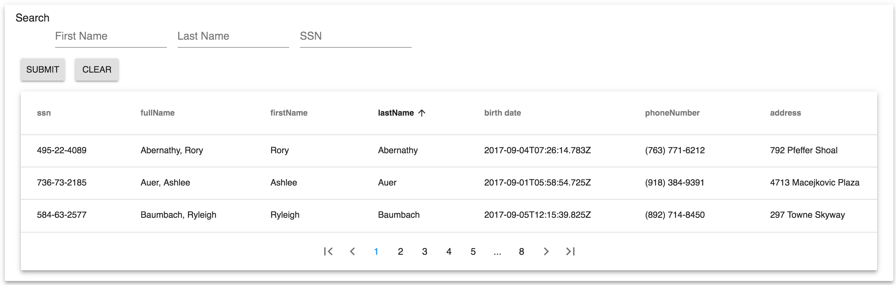

# material-ui-data-table

material-ui table with sorting and pagination goodness

[](https://github.com/prettier/prettier)
[](https://github.com/sindresorhus/xo)

## usage

```js
import debug from 'debug'
import React from 'react'
import Paper from 'material-ui/Paper'
// import DataTable from '../shared/mui/data-table'
import DataTable from 'material-ui-data-table'

const dbg = debug('app:people:results')

const columns = [
  {id: 'ssn'},
  {id: 'fullName'},
  {id: 'firstName'},
  {id: 'lastName'},
  {id: 'dateOfBirth', label: 'birth date'},
  {id: 'phoneNumber'},
  {id: 'address'},
  {id: 'city'},
  {id: 'state'},
  {id: 'zip'}
]

const results = props => {
  dbg('render: props=%o', props)
  const {page, onSort, onPage} = props

  return (
    <Paper elevation={5}>
      <DataTable columns={columns} page={page} onSort={onSort} onPage={onPage} />
    </Paper>
  )
}

export default results
```

### screen-shot



## credits/dependencies

> special thanks to the guys at [ultimate-pagination](https://github.com/ultimate-pagination/react-ultimate-pagination-material-ui)
